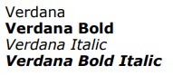
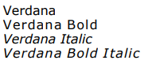

# chromium-not-embedded-font-issue

This repository contains two PDFs:

- [verdana-embedded.pdf](verdana-embedded.pdf)
- [verdana-not-embedded.pdf](verdana-not-embedded.pdf)

Our expectation is that these two PDFs should match in appearance; regular fonts appear regular,
bolded fonts appear bolded, italic fonts appear italicised. Something like below:

However, in some newer versions of Chromium, the `verdana-not-embedded.pdf` file does not render
the bold font correctly. Typically, you'll see something like below instead in those browsers:

We've tested these vendors, versions, and platforms:
| Vendor | Version | Platform | Embedded | Not Embedded |
| - | - | - | - | - |
| Chrome | 128 | Windows | ✔ | ✔ |
| Chrome | 129 | Mac OS X | ✔ | ✔ |
| Chrome | 129 | Windows | ✔ | ❌ |
| Chrome | 131 | Ubuntu | ✔ | ❌ |
| Chrome | 133 | Windows | ✔ | ❌ |
| Chrome | Safari/604 | iOS | ✔ | ✔ |
| Google Drive | 2.24 | Android | ✔ | ❌ |
| Edge | 130 | Windows | ✔ | ✔ |
| Edge | 131 | Mac OS X | ✔ | ✔ |
| Edge | 131 | Windows | ✔ | ❌ |
| Edge | 131 | Android | ✔ | ❌ |
| Edge | 131 | Ubuntu | ✔ | ❌ |
| Edge | 132 | Windows | ✔ | ❌ |
| Firefox | 132 | Windows | ✔ | ✔ |
| Firefox | 132 | Android | ✔ | ✔ |
| Firefox | 133 | Ubuntu | ✔ | ✔ |
| Safari | 18 | Mac OS X | ✔ | ✔ |
| Safari | 605 | iOS | ✔ | ✔ |
| Foxit | 2024.3 | Windows | ✔ | ✔ |
| Adobe Acrobat | 24 | Windows | ✔ | ✔ |
